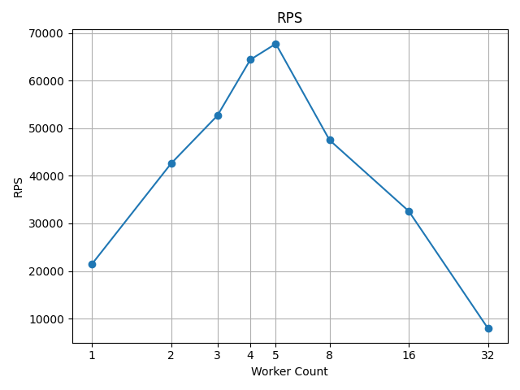
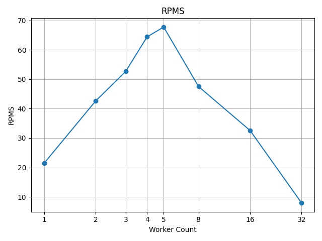
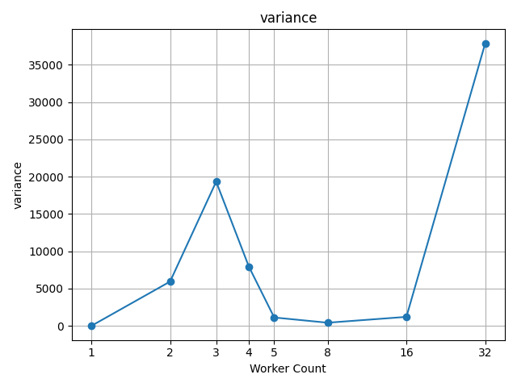

# Java NIO Single Reactor Custom TLV Server

Messing around with NIO, testing some different profiling options such as async-profile, jfr etc and some other techniques
SpaghettiCode ATM

TODO:
* Profile
* Multiple Reactors Design
* Process Message on ThreadPool
* Object Pool buffers
* Fix bugs

Goal: 1m RPS on loopback 

##  TLV Protcol

Number of bytes for type and value is configurable.

**HEADER**: 5 bytes
```
  _-> type 1 byte
 |               ___________________-> body up to 2^32 bytes
 |              |               |
[x, x, x, x, x][x, x, x, ....., x]
    |_________|
         |________-> length  4 bytes
```

### Reserved types:
Error type
```
0b1111_1111
```
### Keep alive:

Highest bit indicate keep alive
```
0b1000_0000 -> keep alive
0b0000_0000 -> not keep alive
```

127 available types with 1 byte for types
```
0bX000_000 -> 0bX111_111
```


## Run

```
./gradlew :analysis:build
java -jar analysis/build/libs/analysis.jar --workers=<workerCount> --payloads=<payloadPerWorker> --name=<resultFileNamePrefix>
```

### Simulation

```
java -Xmx1G -Xms1G -XX:+UseZGC -XX:+AlwaysPreTouch \
-jar analysis/build/libs/analysis.jar \
--workers=<workers> \
--payloads=<payloads> \
--warmups=2 \
--name="Zgc 1gb PreTouch <worker> worker <worker * payloads> requests 2 warmups"
```

| Nio Clients | Payloads Per Client | Avg Request Ms | RPS   |
|-------------|---------------------|----------------|-------|
| 1           | 1_000_000           | 0.04667        |  21423.36     |
| 2           | 500_000             | 0.04696        |  42584.90     |
| 3           | 333_333             | 0.05695        | 52669.41      |
| 4           | 250_000             | 0.06210        | 64410.16      |
| 5           | 200_000             | 0.0737         | 67764.45      |
| 8           | 125_000             | 0.1683         | 47515.81      |
| 16          | 62_500              | 0.4911         | 32574.15      |
| 32          | 31_250              | 4.038          | 7923.81      |










### Run with Flight Record

```
java -Xmx1G -Xms1G -XX:+UseG1GC -XX:+AlwaysPreTouch \
  -XX:StartFlightRecording=duration=60s,filename=flight-recording.jfr,level=info \
  -jar analysis/build/libs/analysis.jar \
   --workers=1 \
    --payloads=100000 \
     --warmups=2 \
      --name="G1 1gb PreTouch 1 worker 100k request 2 warmups JFR"
```


### Run with GC Logging

#### GC1
GC logs
```
java -Xmx1G -Xms1G -XX:+UseG1GC -XX:+AlwaysPreTouch \
 -Xlog:"gc*=info:stdout:time,tid" \
  -jar analysis/build/libs/analysis.jar \
   --workers=1 \
    --payloads=100000 \
     --warmups=2 \
      --name="G1 1gb PreTouch 1 worker 100k request 2 warmups GC info"
```
Without
```
java -Xmx1G -Xms1G -XX:+UseG1GC -XX:+AlwaysPreTouch \
  -jar analysis/build/libs/analysis.jar \
   --workers=1 \
    --payloads=100000 \
     --warmups=2 \
      --name="G1 1gb PreTouch 1 worker 100k request 2 warmups"
```


#### ZGC

GC Logs
```
java -Xmx1G -Xms1G -XX:+UseZGC -XX:+AlwaysPreTouch \
 -Xlog:"gc*=info:stdout:time,tid" \
  -jar analysis/build/libs/analysis.jar \
   --workers=1 \
    --payloads=100000 \
     --warmups=2 \
      --name="Zgc 1gb PreTouch 1 worker 100k request 2 warmups GC info"
```
Without
```
java -Xmx1G -Xms1G -XX:+UseZGC -XX:+AlwaysPreTouch \
  -jar analysis/build/libs/analysis.jar \
   --workers=1 \
    --payloads=1000000 \
     --warmups=2 \
      --name="Zgc 1gb PreTouch 1 worker 1000k request 2 warmups"
```

### Serial

GC Logs
```
java -Xmx1G -XX:+UseSerialGC \
 -Xlog:"gc*=info:stdout:time,tid" \
  -jar analysis/build/libs/analysis.jar \
   --workers=1 \
    --payloads=100000 \
    --warmups=2 \
     --name="Serial 1gb 1 worker 100k request 2 warmups GC info"
```
Without
```
java -Xmx1G -XX:+UseSerialGC \
  -jar analysis/build/libs/analysis.jar \
   --workers=1 \
    --payloads=1000000 \
    --warmups=2 \
     --name="Serial 1gb 1 worker 1000k request 2 warmups"
```